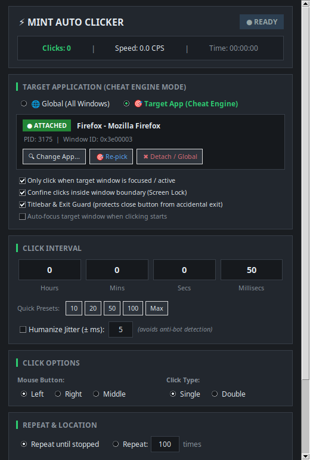

# Mint Auto Clicker ⚡

A modern, fast, and lightweight Auto Clicker designed for **Linux Mint**, Debian, and Ubuntu. Built specifically for clicking simulators (e.g., Roblox, Steam games, web games) and repetitive automation tasks.



---

## 🌟 Features

- **🎯 Target Application / Process Locking (Cheat Engine Style)**:
  - Search open windows or running processes with live instant filtering as you type.
  - **Screen Window Finder (Crosshair tool)**: One-click interactive selector to click on any window on your screen to target it immediately.
  - **Window Confinement (Screen Lock)**: Keeps auto-clicking strictly inside the targeted application window. If your cursor moves outside the application boundary, clicking automatically pauses so clicks never leak to your desktop or other windows.
  - **Active Window Lock**: Automatically pauses clicking when the target application loses focus or if you Alt-Tab away. Resumes instantly when you refocus the game.
  - **Accidental Exit Guard**: Automatically protects the top titlebar and window close button ('X'). Even if your mouse drifts to the top of the window, clicking pauses so you never accidentally close or exit your application!
  - **Auto-Focus Option**: Optionally brings the target application to the front automatically when clicking starts.
- **Global Hotkey Toggle**: Start and stop clicking instantly from inside games using a global hotkey (**F6** by default, customizable to **F1–F12**, **Pause**, **Scroll Lock**, etc.).
- **Click Interval & CPS Presets**:
  - Millisecond-precise timing with Hours, Minutes, Seconds, and Milliseconds controls.
  - Quick CPS buttons: **10 CPS (100ms)**, **20 CPS (50ms)**, **50 CPS (20ms)**, **100 CPS (10ms)**, and **Max (1ms)**.
- **Humanized Jitter (Anti-Cheat Bypass)**:
  - Adds subtle random micro-timing variations (e.g. ±5ms) to prevent game anti-bot / macro detection from flagging perfectly uniform clicking intervals.
- **Mouse Button Options**:
  - Left, Right, or Middle mouse button.
  - Single Click or Double Click mode.
- **Repeat Limits**:
  - Repeat indefinitely until toggled off.
  - Repeat for a specific number of clicks (e.g., 500 clicks then stop).
- **Cursor Position**:
  - **Dynamic**: Follows mouse cursor wherever it moves (ideal for games and simulators).
  - **Fixed Coordinates**: Click a specific (X, Y) coordinate, with a built-in **📍 Pick** screen selector tool.
- **Cinnamon Dark Gaming UI**:
  - Clean Linux Mint theme with status badges, live click counter, active CPS counter, and elapsed time.
  - **Always on Top** toggle to keep the window floating over full-screen or windowed games.
  - Optional sound chime toggle on start/stop.
  - Auto-saves your preferences between sessions to `~/.config/mint-autoclicker/config.json`.

---

## 🚀 Installation

### Option 1: Install System-Wide via `.deb` Package (Recommended)

You can install the `.deb` package using Linux Mint's graphical installer or the terminal:

#### Graphical (GDebi):
1. Open your file manager and locate:
   ```bash
   /home/sam/mint-autoclicker_1.1.0_all.deb
   ```
2. Double-click the `.deb` file.
3. Click **"Install Package"** and enter your password.

#### Terminal:
```bash
sudo dpkg -i /home/sam/mint-autoclicker_1.1.0_all.deb
```
*(If dependencies are needed, run `sudo apt-get install -f`)*

Once installed, **Mint Auto Clicker** will appear in your Linux Mint Application Menu under **Accessories** and **Games**.

---

### Option 2: Instant User-Level Install (No Sudo Required)

If you don't want to type your root password, run the included installer:
```bash
/home/sam/mint-autoclicker/install.sh
```
This automatically registers the desktop icon and application menu entry in `~/.local/share/applications/` and places the command in `~/.local/bin/mint-autoclicker`.

---

## 🎮 How to Use with Clicking Simulators

1. Launch **Mint Auto Clicker** from your application menu or by running `mint-autoclicker`.
2. Choose your preferred speed:
   - For fast clicking: Click the **20** (20 CPS / 50ms) or **50** (50 CPS / 20ms) preset.
   - For Roblox or anti-bot safety: Check **Humanize Jitter (± ms)** (e.g., 5ms).
3. Check **Always on Top** if you want to keep the click counter visible over your game.
4. Focus your simulator or game window, hover where you want to click, and press **F6** (or your selected hotkey) to start clicking!
5. Press **F6** again at any time to immediately stop.

---

## 🛠 Rebuilding the `.deb` Package

To rebuild the `.deb` package at any time:
```bash
cd /home/sam/mint-autoclicker
./build_deb.sh
```
The output `.deb` will be generated at `/home/sam/mint-autoclicker_1.1.0_all.deb`.
